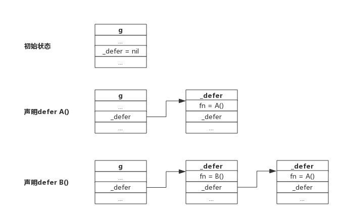

# 1. 前言
defer语句用于延迟函数的调用，每次defer都会把一个函数压入栈中，函数返回前再把延迟的函数取出并执行。

为了方便描述，我们把创建defer的函数称为主函数，defer语句后面的函数称为延迟函数。

延迟函数可能有输入参数，这些参数可能来源于定义defer的函数，延迟函数也可能引用主函数用于返回的变量，也就是说延迟函数可能会影响主函数的一些行为，这些场景下，如果不了解defer的规则很容易出错。

其实官方说明的defer的三个原则很清楚，本节试图汇总defer的使用场景并做简单说明。

# 2. 热身
按照惯例，我们看几个有意思的题目，用于检验对defer的了解程度。

## 2.1 题目一
下面函数输出结果是什么？
```go
func deferFuncParameter() {
    var aInt = 1

    defer fmt.Println(aInt)

    aInt = 2
    return
}
```
题目说明：  
函数deferFuncParameter()定义一个整型变量并初始化为1，然后使用defer语句打印出变量值，最后修改变量值为2.

参考答案：  
输出1。延迟函数fmt.Println(aInt)的参数在defer语句出现时就已经确定了，所以无论后面如何修改aInt变量都不会影响延迟函数。

## 2.2 题目二
下面程序输出什么？
```go
package main

import "fmt"

func printArray(array *[3]int) {
    for i := range array {
        fmt.Println(array[i])
    }
}

func deferFuncParameter() {
    var aArray = [3]int{1, 2, 3}

    defer printArray(&aArray)

    aArray[0] = 10
    return
}

func main() {
    deferFuncParameter()
}
```
函数说明：  
函数deferFuncParameter()定义一个数组，通过defer延迟函数printArray()的调用，最后修改数组第一个元素。printArray()函数接受数组的指针并把数组全部打印出来。

参考答案：  
输出10、2、3三个值。延迟函数printArray()的参数在defer语句出现时就已经确定了，即数组的地址，由于延迟函数执行时机是在return语句之前，所以对数组的最终修改值会被打印出来。

## 2.3 题目三
下面函数输出什么？
```go
func deferFuncReturn() (result int) {
    i := 1

    defer func() {
       result++
    }()

    return i
}
```
函数说明：  
函数拥有一个具名返回值result，函数内部声明一个变量i，defer指定一个延迟函数，最后返回变量i。延迟函数中递增result。

参考答案：  
函数输出2。函数的return语句并不是原子的，实际执行分为设置返回值-->ret，defer语句实际执行在返回前，即拥有defer的函数返回过程是：设置返回值-->执行defer-->ret。所以return语句先把result设置为i的值，即1，defer语句中又把result递增1，所以最终返回2。

# 3. defer规则
Golang官方博客里总结了defer的行为规则，只有三条，我们围绕这三条进行说明。

## 3.1 规则一：延迟函数的参数在defer语句出现时就已经确定下来了
官方给出一个例子，如下所示：
```go
func a() {
    i := 0
    defer fmt.Println(i)
    i++
    return
}
```
defer语句中的fmt.Println()参数i值在defer出现时就已经确定下来，实际上是拷贝了一份。后面对变量i的修改不会影响fmt.Println()函数的执行，仍然打印"0"。

注意：对于指针类型参数，规则仍然适用，只不过延迟函数的参数是一个地址值，这种情况下，defer后面的语句对变量的修改可能会影响延迟函数。

## 3.2 规则二：延迟函数执行按后进先出顺序执行，即先出现的defer最后执行
这个规则很好理解，定义defer类似于入栈操作，执行defer类似于出栈操作。

设计defer的初衷是简化函数返回时资源清理的动作，资源往往有依赖顺序，比如先申请A资源，再跟据A资源申请B资源，跟据B资源申请C资源，即申请顺序是:A-->B-->C，释放时往往又要反向进行。这就是把defer设计成LIFO的原因。

每申请到一个用完需要释放的资源时，立即定义一个defer来释放资源是个很好的习惯。

## 3.3 规则三：延迟函数可能操作主函数的具名返回值
定义defer的函数，即主函数可能有返回值，返回值有没有名字没有关系，defer所作用的函数，即延迟函数可能会影响到返回值。

若要理解延迟函数是如何影响主函数返回值的，只要明白函数是如何返回的就足够了。

### 3.3.1 函数返回过程
有一个事实必须要了解，关键字*return*不是一个原子操作，实际上*return*只代理汇编指令*ret*，即将跳转程序执行。比如语句`return i`，实际上分两步进行，即将i值存入栈中作为返回值，然后执行跳转，而defer的执行时机正是跳转前，所以说defer执行时还是有机会操作返回值的。

举个实际的例子进行说明这个过程：
```go
func deferFuncReturn() (result int) {
    i := 1

    defer func() {
       result++
    }()

    return i
}
```
该函数的return语句可以拆分成下面两行：
```go
result = i
return
```
而延迟函数的执行正是在return之前，即加入defer后的执行过程如下：
```go
result = i
result++
return
```
所以上面函数实际返回i++值。

关于主函数有不同的返回方式，但返回机制就如上机介绍所说，只要把return语句拆开都可以很好的理解，下面分别举例说明

### 3.3.2 主函数拥有匿名返回值，返回字面值
一个主函数拥有一个匿名的返回值，返回时使用字面值，比如返回"1"、"2"、"Hello"这样的值，这种情况下defer语句是无法操作返回值的。

一个返回字面值的函数，如下所示：
```go
func foo() int {
    var i int

    defer func() {
        i++
    }()

    return 1
}
```
上面的return语句，直接把1写入栈中作为返回值，延迟函数无法操作该返回值，所以就无法影响返回值。

### 3.3.3 主函数拥有匿名返回值，返回变量
一个主函数拥有一个匿名的返回值，返回使用本地或全局变量，这种情况下defer语句可以引用到返回值，但不会改变返回值。

一个返回本地变量的函数，如下所示：
```go
func foo() int {
    var i int

    defer func() {
        i++
    }()

    return i
}
```
上面的函数，返回一个局部变量，同时defer函数也会操作这个局部变量。对于匿名返回值来说，可以假定仍然有一个变量存储返回值，假定返回值变量为"anony"，上面的返回语句可以拆分成以下过程：
```go
anony = i
i++
return
```
由于i是整型，会将值拷贝给anony，所以defer语句中修改i值，对函数返回值不造成影响。

### 3.3.4 主函数拥有具名返回值
主函声明语句中带名字的返回值，会被初始化成一个局部变量，函数内部可以像使用局部变量一样使用该返回值。如果defer语句操作该返回值，可能会改变返回结果。

一个影响函返回值的例子：
```go
func foo() (ret int) {
    defer func() {
        ret++
    }()

    return 0
}
```
上面的函数拆解出来，如下所示：
```go
ret = 0
ret++
return
```
函数真正返回前，在defer中对返回值做了+1操作，所以函数最终返回1。

# 4. defer实现原理
本节我们尝试了解一些defer的实现机制。

## 4.1 defer数据结构
源码包`src/src/runtime/runtime2.go:_defer`定义了defer的数据结构：
```go
type _defer struct {
    sp      uintptr   //函数栈指针
    pc      uintptr   //程序计数器
    fn      *funcval  //函数地址
    link    *_defer   //指向自身结构的指针，用于链接多个defer
}
```
我们知道defer后面一定要接一个函数的，所以defer的数据结构跟一般函数类似，也有栈地址、程序计数器、函数地址等等。

与函数不同的一点是它含有一个指针，可用于指向另一个defer，每个goroutine数据结构中实际上也有一个defer指针，该指针指向一个defer的单链表，每次声明一个defer时就将defer插入到单链表表头，每次执行defer时就从单链表表头取出一个defer执行。

下图展示多个defer被链接的过程：



从上图可以看到，新声明的defer总是添加到链表头部。

函数返回前执行defer则是从链表首部依次取出执行，不再赘述。

一个goroutine可能连续调用多个函数，defer添加过程跟上述流程一致，进入函数时添加defer，离开函数时取出defer，所以即便调用多个函数，也总是能保证defer是按FIFO方式执行的。

## 4.2 defer的创建和执行
源码包`src/runtime/panic.go`定义了两个方法分别用于创建defer和执行defer。
- deferproc()： 在声明defer处调用，其将defer函数存入goroutine的链表中；
- deferreturn()：在return指令，准确的讲是在ret指令前调用，其将defer从goroutine链表中取出并执行。

可以简单这么理解，在编译在阶段，声明defer处插入了函数deferproc()，在函数return前插入了函数deferreturn()。

# 5. 总结
- defer定义的延迟函数参数在defer语句出时就已经确定下来了
- defer定义顺序与实际执行顺序相反
- return不是原子操作，执行过程是: 保存返回值(若有)-->执行defer（若有）-->执行ret跳转
- 申请资源后立即使用defer关闭资源是好习惯
