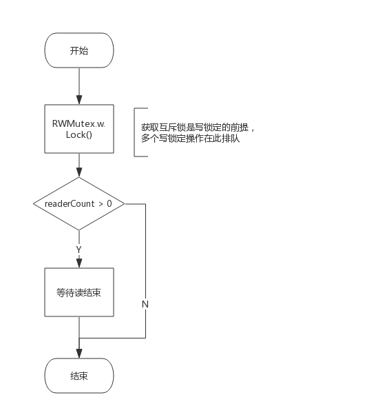
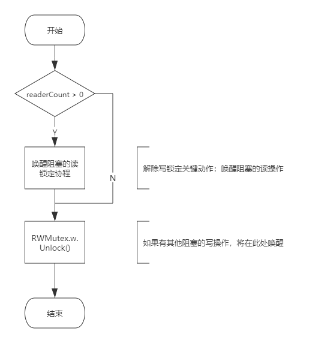
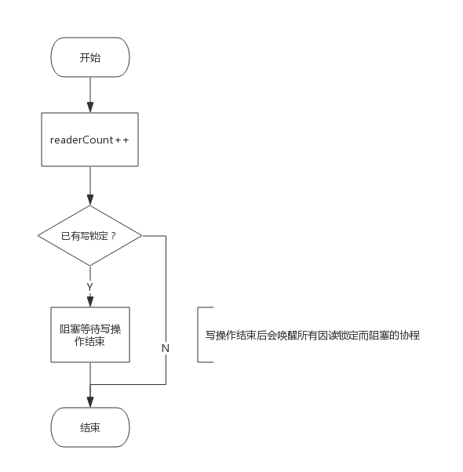
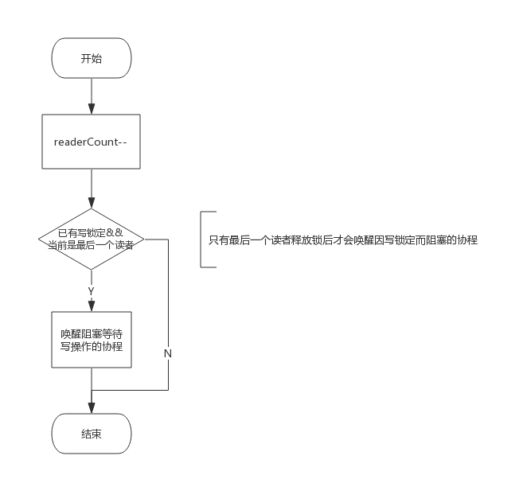

# 1. 前言

前面我们聊了互斥锁Mutex，所谓读写锁RWMutex，完整的表述应该是读写互斥锁，可以说是Mutex的一个改进版，在某些场景下可以发挥更加灵活的控制能力，比如：读取数据频率远远大于写数据频率的场景。

例如，程序中写操作少而读操作多，简单的说，如果执行过程是1次写然后N次读的话，使用Mutex，这个过程将是串行的，因为即便N次读操作互相之间并不影响，但也都需要持有Mutex后才可以操作。如果使用读写锁，多个读操作可以同时持有锁，并发能力将大大提升。

实现读写锁需要解决如下几个问题：
1. 写锁需要阻塞写锁：一个协程拥有写锁时，其他协程写锁定需要阻塞
2. 写锁需要阻塞读锁：一个协程拥有写锁时，其他协程读锁定需要阻塞
3. 读锁需要阻塞写锁：一个协程拥有读锁时，其他协程写锁定需要阻塞
4. 读锁不能阻塞读锁：一个协程拥有读锁时，其他协程也可以拥有读锁

下面我们将按照这个思路，即读写锁如何解决这些问题的，来分析读写锁的实现。

读写锁基于Mutex实现，实现源码非常简单和简洁，又有一定的技巧在里面。

# 2. 读写锁数据结构

## 2.1 类型定义

源码包`src/sync/rwmutex.go:RWMutex`定义了读写锁数据结构：
```go
type RWMutex struct {
	w           Mutex  //用于控制多个写锁，获得写锁首先要获取该锁，如果有一个写锁在进行，那么再到来的写锁将会阻塞于此
	writerSem   uint32 //写阻塞等待的信号量，最后一个读者释放锁时会释放信号量
	readerSem   uint32 //读阻塞的协程等待的信号量，持有写锁的协程释放锁后会释放信号量
	readerCount int32  //记录读者个数
	readerWait  int32  //记录写阻塞时读者个数
}
```

由以上数据结构可见，读写锁内部仍有一个互斥锁，用于将两个写操作隔离开来，其他的几个都用于隔离读操作和写操作。

下面我们简单看下RWMutex提供的4个接口，后面再跟据使用场景具体分析这几个成员是如何配合工作的。

## 2.2 接口定义

RWMutex提供4个简单的接口来提供服务：
- RLock()：读锁定
- RUnlock()：解除读锁定
- Lock(): 写锁定，与Mutex完全一致
- Unlock()：解除写锁定，与Mutex完全一致

## 2.2.1 Lock()实现逻辑

写锁定操作需要做两件事：
- 获取互斥锁
- 阻塞等待所有读操作结束（如果有的话）

所以`func (rw *RWMutex) Lock()`接口实现流程如下图所示：



## 2.2.2 Unlock()实现逻辑

解除写锁定要做两件事：
- 唤醒因读锁定而被阻塞的协程（如果有的话）
- 解除互斥锁

所以`func (rw *RWMutex) Unlock()`接口实现流程如下图所示：




## 2.2.3 RLock()实现逻辑

读锁定需要做两件事：
- 增加读操作计数，即readerCount++
- 阻塞等待写操作结束(如果有的话)

所以`func (rw *RWMutex) RLock()`接口实现流程如下图所示：



## 2.2.4 RUnlock()实现逻辑

解除读锁定需要做两件事：
- 减少读操作计数，即readerCount--
- 唤醒等待写操作的协程（如果有的话）

所以`func (rw *RWMutex) RUnlock()`接口实现流程如下图所示：



注意：即便有协程阻塞等待写操作，并不是所有的解除读锁定操作都会唤醒该协程，而是最后一个解除读锁定的协程才会释放信号量将该协程唤醒，因为只有当所有读操作的协程释放锁后才可以唤醒协程。

# 3. 场景分析

上面我们简单看了下4个接口实现原理，接下来我们看一下是如何解决前面提到的几个问题的。

## 3.1 写操作是如何阻止写操作的

读写锁包含一个互斥锁(Mutex)，写锁定必须要先获取该互斥锁，如果互斥锁已被协程A获取（或者协程A在阻塞等待读结束），意味着协程A获取了互斥锁，那么协程B只能阻塞等待该互斥锁。

所以，写操作依赖互斥锁阻止其他的写操作。

## 3.2 写操作是如何阻止读操作的

这个是读写锁实现中最精华的技巧。

我们知道RWMutex.readerCount是个整型值，用于表示读者数量，不考虑写操作的情况下，每次读锁定将该值+1，每次解除读锁定将该值-1，所以readerCount取值为[0, N]，N为读者个数，实际上最大可支持2^30个并发读者。

当写锁定进行时，会先将readerCount减去2^30，从而readerCount变成了负值，此时再有读锁定到来时检测到readerCount为负值，便知道有写操作在进行，只好阻塞等待。而真实的读操作个数并不会丢失，只需要将readerCount加上2^30即可获得。

所以，写操作将readerCount变成负值来阻止读操作的。

## 3.3 读操作是如何阻止写操作的

读锁定会先将RWMutext.readerCount加1，此时写操作到来时发现读者数量不为0，会阻塞等待所有读操作结束。

所以，读操作通过readerCount来将来阻止写操作的。

## 3.4 为什么写锁定不会被饿死

我们知道，写操作要等待读操作结束后才可以获得锁，写操作等待期间可能还有新的读操作持续到来，如果写操作等待所有读操作结束，很可能被饿死。然而，通过RWMutex.readerWait可完美解决这个问题。

写操作到来时，会把RWMutex.readerCount值拷贝到RWMutex.readerWait中，用于标记排在写操作前面的读者个数。

前面的读操作结束后，除了会递减RWMutex.readerCount，还会递减RWMutex.readerWait值，当RWMutex.readerWait值变为0时唤醒写操作。

所以以，写操作就相当于把一段连续的读操作划分成两部分，前面的读操作结束后唤醒写操作，写操作结束后唤醒后面的读操作。如下图所示：


## 4. 关于源码

关于读写锁的实现源码，我添加了大量的中文注释，如有兴趣，请自行查看。
源码地址注解：https://github.com/RainbowMango/GoComments
