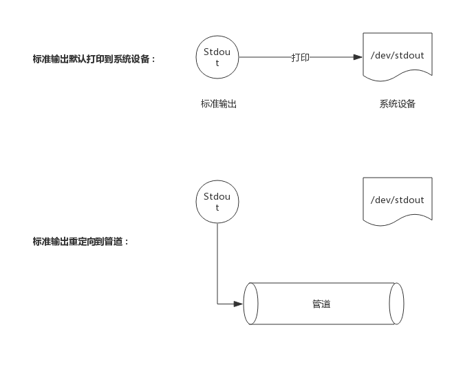

## 简介
示例测试相对于单元测试和性能测试来说，其实现机制比较简单。它没有复杂的数据结构，也不需要额外的流程控制，其核心工作原理在于收集测试过程中的打印日志，然后与期望字符串做比较，最后得出是否一致的报告。

## 数据结构
每个测试经过编译后都有一个数据结构来承载，这个数据结构即`InternalExample`:
```go
type InternalExample struct {
	Name      string    // 测试名称
	F         func()   // 测试函数
	Output    string    // 期望字符串
	Unordered bool      // 输出是否是无序的
}
```
比如，示例测试如下：
```go
// 检测乱序输出
func ExamplePrintNames() {
    gotest.PrintNames()
    // Unordered output:
    // Jim
    // Bob
    // Tom
    // Sue
}
```
该示例测试经过编译后，产生的数据结构成员如下：
* InternalExample.Name = "ExamplePrintNames";
* InternalExample.F = ExamplePrintNames()
* InternalExample.Output = "Jim\n Bob\n Tom\n Sue\n"
* InternalExample.Unordered = true;

其中Output是包含换行符的字符串。

## 捕获标准输出
在示例测试开始前，需要先把标准输出捕获，以便获取测试执行过程中的打印日志。

捕获标准输出方法是新建一个管道，将标准输出重定向到管道的入口(写口)，这样所有打印到屏幕的日志都会输入到管道中，如下图所示：



测试开始前捕获，测试结束恢复标准输出，这样测试过程中的日志就可以从管理中读取了。

## 测试结果比较
测试执行过程的输出内容最终也会保存到一个string类型变量里，该变量会与InternalExample.Output进行比较，二者一致即代表测试通过，否则测试失败。

输出有序的情况下，比较很简单只是比较两个String内容是否一致即可。无序的情况下则需要把两个String变量排序后再进行对比。

比如，期望字符串为："Jim\n Bob\n Tom\n Sue\n"，排序后则变为："Bob\n Jim\n Sue\n Tom\n"

## 测试执行
一个完整的测试，过程将分为如下步骤：
1. 捕获标准输出
2. 执行测试
3. 恢复标准输出
4. 比较结果

下面，由于源码非常简单，下面直接给出源码：
```go
func runExample(eg InternalExample) (ok bool) {
	if *chatty {
		fmt.Printf("=== RUN   %s\n", eg.Name)
	}

	// Capture stdout.
	stdout := os.Stdout      // 备份标输出文件
	r, w, err := os.Pipe()   // 创建一个管道
	if err != nil {
		fmt.Fprintln(os.Stderr, err)
		os.Exit(1)
	}
	os.Stdout = w           // 标准输出文件暂时修改为管道的入口，即所有的标准输出实际上都会进入管道
	outC := make(chan string)
	go func() {
		var buf strings.Builder
		_, err := io.Copy(&buf, r)  // 从管道中读出数据
		r.Close()
		if err != nil {
			fmt.Fprintf(os.Stderr, "testing: copying pipe: %v\n", err)
			os.Exit(1)
		}
		outC <- buf.String()  // 管道中读出的数据写入channel中
	}()

	start := time.Now()
	ok = true

	// Clean up in a deferred call so we can recover if the example panics.
	defer func() {
		dstr := fmtDuration(time.Since(start))         // 计时结束，记录测试用时

		// Close pipe, restore stdout, get output.
		w.Close()                // 关闭管道
		os.Stdout = stdout       // 恢复原标准输出
		out := <-outC            // 从channel中取出数据

		var fail string
		err := recover()
		got := strings.TrimSpace(out)        // 实际得到的打印字符串
		want := strings.TrimSpace(eg.Output) // 期望的字符串
		if eg.Unordered { // 如果输出是无序的，则把输出字符串和期望字符串排序后比较
			if sortLines(got) != sortLines(want) && err == nil {
				fail = fmt.Sprintf("got:\n%s\nwant (unordered):\n%s\n", out, eg.Output)
			}
		} else { // 如果输出是有序的，则直接比较输出字符串和期望字符串
			if got != want && err == nil {
				fail = fmt.Sprintf("got:\n%s\nwant:\n%s\n", got, want)
			}
		}
		if fail != "" || err != nil {
			fmt.Printf("--- FAIL: %s (%s)\n%s", eg.Name, dstr, fail)
			ok = false
		} else if *chatty {
			fmt.Printf("--- PASS: %s (%s)\n", eg.Name, dstr)
		}
		if err != nil {
			panic(err)
		}
	}()

	// Run example.
	eg.F()
	return
}
```
示例测试执行时，捕获标准输出后，马上启动一个协程阻塞在管道处读取数据，一直阻塞到管道关闭，管道关闭也即读取结束，然后把日志通过channel发送到主协程中。

主协程直接执行示例测试，而在defer中去执行关闭管道、接收日志、判断结果等操作。
